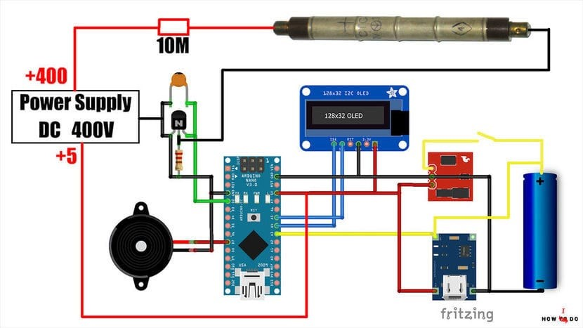
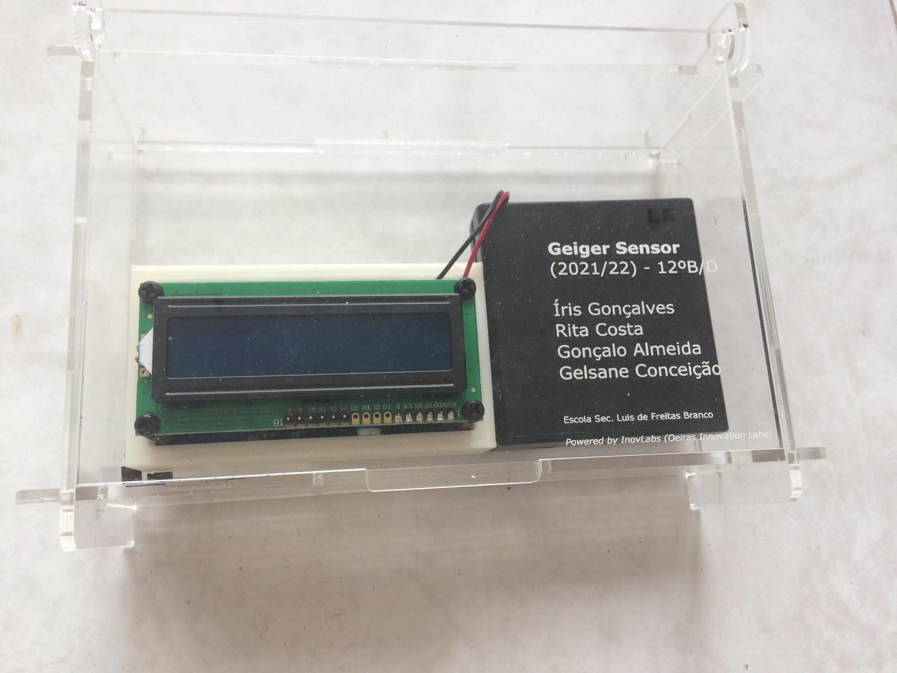
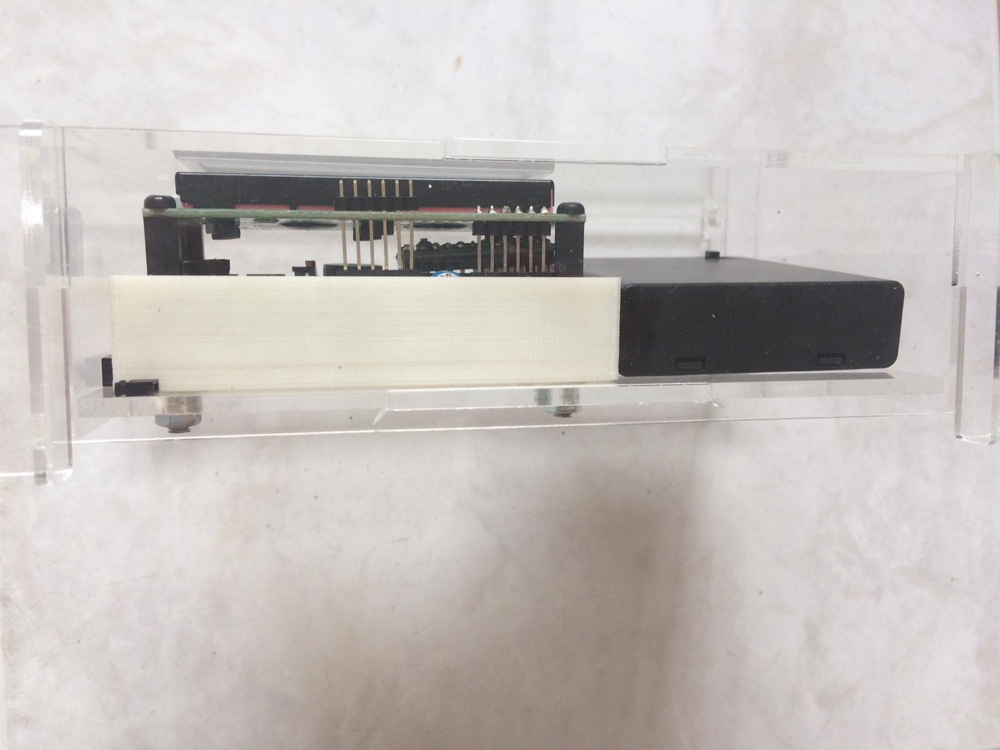

# DIY Geiger Counter

This is a DIY Geiger counter project developed as part of a high school project. The Geiger counter is a device that detects ionizing radiation, commonly used in scientific experiments and environmental monitoring.

## Description

Refer to the PDFs for details.

 

